```r
rm(list=ls())
setwd("C:/Furong/3-Internship/Lending Club")   

loanstats = rbind(read.csv( "LoanStats_securev1_2016Q1.csv", skip=1 ),  
                  read.csv( "LoanStats_securev1_2016Q2.csv", skip=1 ),
                  read.csv( "LoanStats_securev1_2016Q3.csv", skip=1 ),  
                  read.csv( "LoanStats_securev1_2016Q4.csv", skip=1 ))

loanstats = loanstats[loanstats$grade != "", ]
loanstats$int_rate = as.numeric(sub("%", "",loanstats$int_rate))
badloanstats = subset(loanstats, loan_status == "Charged Off"| loan_status == "Default")
```


```r
library(ggplot2)
```

```
## Warning: package 'ggplot2' was built under R version 3.5.1
```

```r
library(dplyr)
```

```
## Warning: package 'dplyr' was built under R version 3.5.1
```

```
## 
## Attaching package: 'dplyr'
```

```
## The following objects are masked from 'package:stats':
## 
##     filter, lag
```

```
## The following objects are masked from 'package:base':
## 
##     intersect, setdiff, setequal, union
```

```r
library(gridExtra)
```

```
## Warning: package 'gridExtra' was built under R version 3.5.1
```

```
## 
## Attaching package: 'gridExtra'
```

```
## The following object is masked from 'package:dplyr':
## 
##     combine
```

```r
library(stringr)
```

```
## Warning: package 'stringr' was built under R version 3.5.1
```

```r
grid.arrange(ggplot(loanstats,aes(x=sub_grade, y=int_rate, fill=grade))+ 
                            geom_boxplot()+ theme_bw()+ labs(x = "Sub Grade", y = "Interest Rate(%)")+
                            ggtitle("Interest Rate by Grade"),
ggplot(loanstats,aes(x=sub_grade, y=funded_amnt, fill=grade))+ 
                            geom_boxplot()+ theme_bw()+ labs(x = "Sub Grade", y = "Funded Amount")+
                            ggtitle("Funded Amount by Grade"),
ncol=1)
```

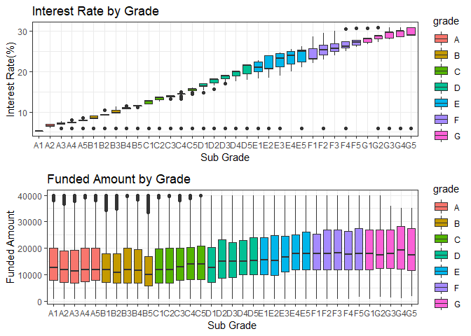<!-- -->


```r
type_all = loanstats %>%  group_by(application_type) %>%  summarise(counts = n())
type_bad = badloanstats %>%  group_by(application_type) %>%  summarise(counts = n())

type_all$BadLoanRate = type_bad$counts/type_all$counts

bar_type = ggplot( type_all, aes(x = application_type, y =  BadLoanRate , fill = application_type))+ 
                          geom_col()+ theme_bw()+ 
                          labs(x = "Application Type", y = "BadLoanRate")+
                          ggtitle("Bad Loan Rate by Type")

hist_type = ggplot( badloanstats, aes(x = application_type, stat="count",fill=application_type))+ 
                          geom_bar()+ theme_bw()+ labs(x = "Application Type", y = "Frequency")+
                          ggtitle("Bad Loan Frenquency by Type")

grid.arrange(bar_type, hist_type, nrow=1 )
```

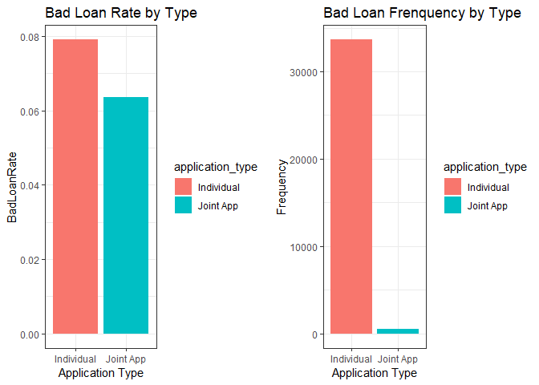<!-- -->


```r
subgrade_all = loanstats %>%  group_by(grade, sub_grade) %>%  summarise(counts = n())
subgrade_bad = badloanstats %>%  group_by(grade,sub_grade) %>%  summarise(counts = n())
subgrade_all$BadLoanRate = subgrade_bad$counts/subgrade_all$counts

grade = merge(subgrade_all, subgrade_bad, by.x = c("grade", "sub_grade"), by.y = c("grade", "sub_grade"),suffixes = c(".all",".sub"))

bar_BadLoanRate = ggplot( subgrade_all, aes(x = sub_grade, y =  BadLoanRate , colour = factor(grade)))+ 
                          geom_point()+ theme_bw()+ 
                          labs(x = "Sub Grade", y = "BadLoanRate")+
                          ggtitle("Bad Loan Rate by Grade")+
                          theme(legend.title=element_blank())


hist_grade = ggplot(grade)+ geom_col( aes(x = sub_grade, y = counts.all, fill = grade),alpha=0.25)+ 
                          theme_bw()+ labs(x = "Sub Grade", y = "Frequency")+
                          ggtitle("Total Frequency and Bad Loan Frequency by Grade")+
                          theme(legend.title=element_blank())+
                          geom_col( aes(x = sub_grade, y = counts.sub, fill = grade))
  
grid.arrange(bar_BadLoanRate,hist_grade, ncol=1 )
```

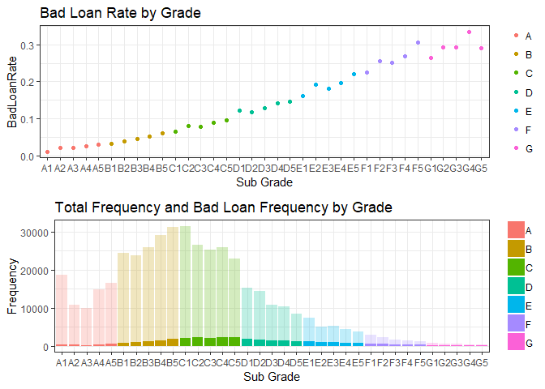<!-- -->


```r
homeown_all = loanstats %>%  group_by(home_ownership) %>%  summarise(counts = n())
homeown_bad = badloanstats %>%  group_by(home_ownership) %>%  summarise(counts = n())
homeown_all$BadLoanRate = homeown_bad$counts/homeown_all$counts

homeown = merge(homeown_all, homeown_bad, by.x = "home_ownership", by.y = "home_ownership",suffixes = c(".all",".sub"))

home_BadLoanRate = ggplot( homeown_all, aes(x = home_ownership, y =  BadLoanRate , colour = factor(home_ownership)))+ geom_point()+ theme_bw()+ 
                          labs(x = "Home Ownership", y = "Bad Loan Rate")+
                          ggtitle("Bad Loan Rate by Home Ownership")+
                          theme(legend.title=element_blank())


hist_home = ggplot(homeown)+ geom_col( aes(x = home_ownership, y = counts.all, fill = home_ownership),alpha=0.25)+ 
                          theme_bw()+ labs(x = "Home Ownership", y = "Frequency")+
                          ggtitle("Total Frequency and Bad Loan Frequency by Home Ownership")+
                          theme(legend.title=element_blank())+
                          geom_col( aes(x = home_ownership, y = counts.sub, fill = home_ownership))
  
grid.arrange( home_BadLoanRate , hist_home, nrow=1 )
```

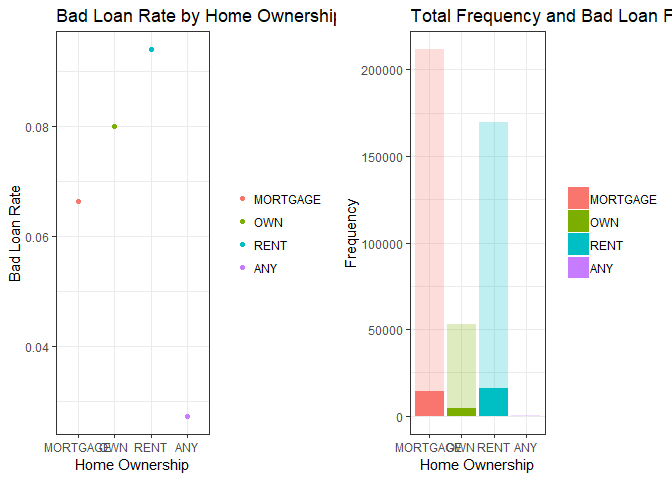<!-- -->


```r
term_all = loanstats %>%  group_by(term) %>%  summarise(counts = n())
term_bad = badloanstats %>%  group_by(term) %>%  summarise(counts = n())
term_all$BadLoanRate = term_bad$counts/term_all$counts

term = merge(term_all, term_bad, by.x = "term", by.y = "term",suffixes = c(".all",".sub"))

home_BadLoanRate = ggplot( term, aes(x = term, y =  BadLoanRate , colour = factor(term)))+ geom_point()+ theme_bw()+ 
                          labs(x = "Loan Term", y = "Bad Loan Rate")+
                          ggtitle("Bad Loan Rate by Loan Term")+
                          theme(legend.title=element_blank())


hist_term = ggplot(term)+ geom_col( aes(x = term, y = counts.all, fill = term),alpha=0.25)+ 
                          theme_bw()+ labs(x = "Loan Term", y = "Frequency")+
                          ggtitle("Total Frequency and Bad Loan Frequency by Loan Term")+
                          theme(legend.title=element_blank())+
                          geom_col( aes(x = term, y = counts.sub, fill = term))
  
grid.arrange( home_BadLoanRate, hist_term, nrow=1 )
```

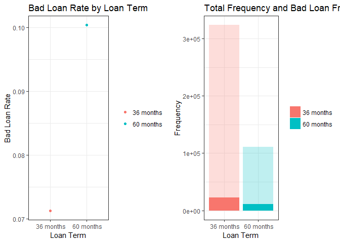<!-- -->


```r
emp_all = loanstats[loanstats$emp_length != "n/a",] %>%  group_by(emp_length)%>%  summarise(counts = n())
emp_bad = badloanstats[badloanstats$emp_length != "n/a",] %>%  group_by(emp_length) %>%  summarise(counts = n())
emp_all$BadLoanRate = emp_bad$counts/emp_all$counts


emp =merge(emp_all,emp_bad, by.x = "emp_length", by.y = "emp_length",suffixes = c(".all",".sub"))
levels(emp) = as.factor(c("< 1 year","1 year","2 years", "3 years", "4 years", "5 years", "6 years",   "7 years",   "8 years",   "9 years", "10+ years")) 
emp_BadLoanRate = ggplot( emp, aes(x = emp_length, y =  BadLoanRate , colour = factor(emp_length)))+ geom_point()+ theme_bw()+ 
                          labs(x = "Employment length", y = "Bad Loan Rate")+
                          ggtitle("Bad Loan Rate by Employment length")+
                          theme(legend.title=element_blank())


hist_emp = ggplot(emp)+ geom_col( aes(x = emp_length, y = counts.all, fill = emp_length),alpha=0.25)+ 
                          theme_bw()+ labs(x = "Employment length", y = "Employment length")+
                          ggtitle("Total Frequency & Bad Loan Frequency by Employment length")+
                          theme(legend.title=element_blank())+
                          geom_col( aes(x = emp_length, y = counts.sub, fill = emp_length))
  
grid.arrange( emp_BadLoanRate , hist_emp, ncol=1 )
```

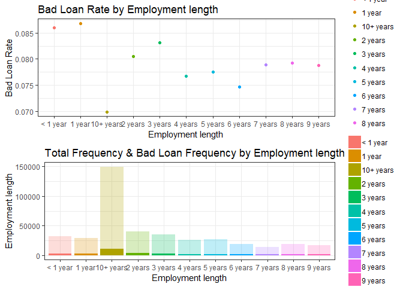<!-- -->


```r
purpose_all = loanstats %>%  group_by(purpose) %>%  summarise(counts = n())
purpose_bad = badloanstats %>%  group_by(purpose) %>%  summarise(counts = n())
purpose_bad = rbind(purpose_bad, c("wedding", 0))
purpose_bad$counts = as.numeric(purpose_bad$counts)
purpose_all$BadLoanRate = purpose_bad$counts / purpose_all$counts
purpose = merge(purpose_all, purpose_bad, by.x = "purpose", by.y = "purpose",suffixes = c(".all",".sub"))

rate_purpose = 
ggplot(purpose_all,aes(x=purpose, y=BadLoanRate, colour = factor(purpose)))+ 
geom_point(show.legend=FALSE)+ theme_bw()+ labs(x = "Purpose", y = "Bad Loan Rate")+
ggtitle(" Bad Loan Rate by Purpose")+ coord_flip()+
theme(title =element_text(size=10))

Frequency_purpose = ggplot(purpose)+ 
geom_col( aes(x = purpose, y = counts.all, fill = purpose),alpha=0.25, show.legend=FALSE)+    theme_bw()+ labs(x = "Purpose", y = "Frequency")+
ggtitle("Total Frequency and Bad Loan Frequency by Purpose")+
geom_col( aes(x = purpose, y = counts.sub, fill = purpose),show.legend=FALSE)+ theme(legend.title=element_blank(), title =element_text(size=10), axis.title.y=element_blank(),
axis.text.y=element_blank(),axis.ticks.y=element_blank()) + coord_flip() 

grid.arrange(rate_purpose, Frequency_purpose, nrow=1 )
```

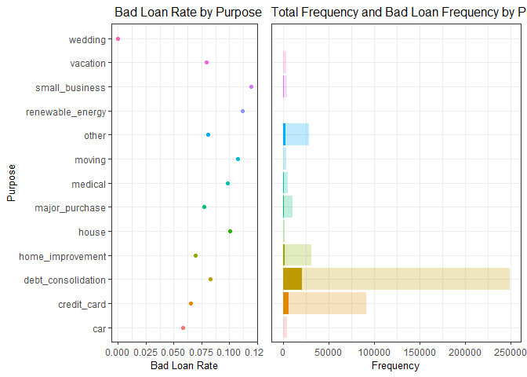<!-- -->


```r
ggplot(loanstats,aes(x=installment, colour = loan_status))+ 
geom_freqpoly()+ theme_bw()+ labs(x = "installment", y = "Frequency")
```

```
## `stat_bin()` using `bins = 30`. Pick better value with `binwidth`.
```

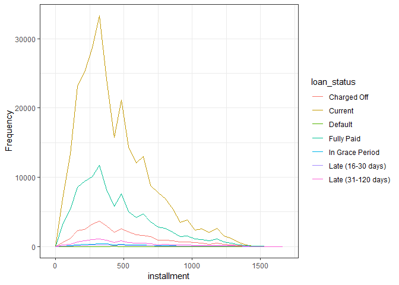<!-- -->

```r
ggplot(loanstats,aes(x= funded_amnt))+ 
geom_bar()+ theme_bw()+ labs(x = "Funded Amount", y = "Density")
```

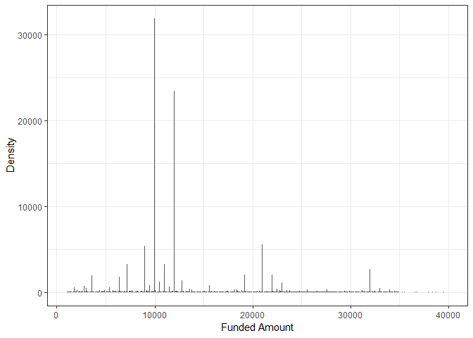<!-- -->

```r
qplot(loanstats$funded_amnt, geom="histogram",main = "Histogram for Funded Amount", binwidth = 1000,
      xlab = "Funded Amount", ylab= "Counts",alpha=I(.25), fill=I("blue"), col=I("black"))+ theme_bw()
```

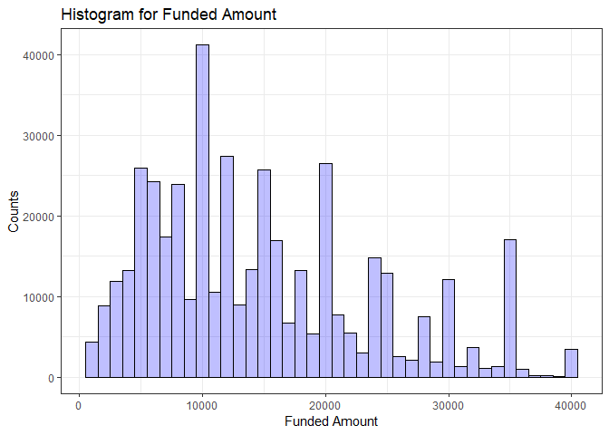<!-- -->

```r
qplot(loanstats$funded_amnt, geom="density")+ theme_bw()
```

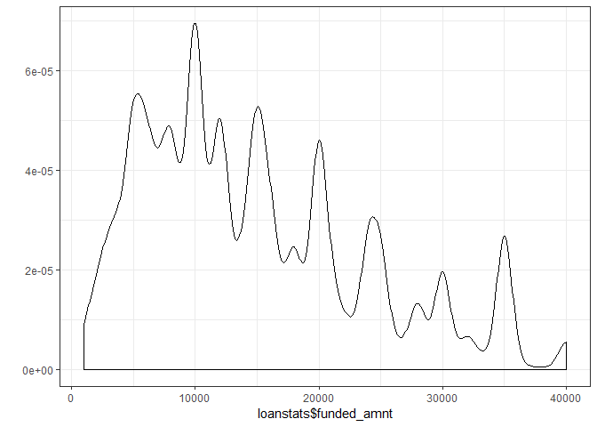<!-- -->

```r
qplot(loanstats$int_rate, geom="histogram",main = "Histogram for Interest Rate", xlab = "Interest Rate (%) ", ylab= "Frequency",fill = I("pink"), col=I("black"))+ theme_bw()
```

```
## `stat_bin()` using `bins = 30`. Pick better value with `binwidth`.
```

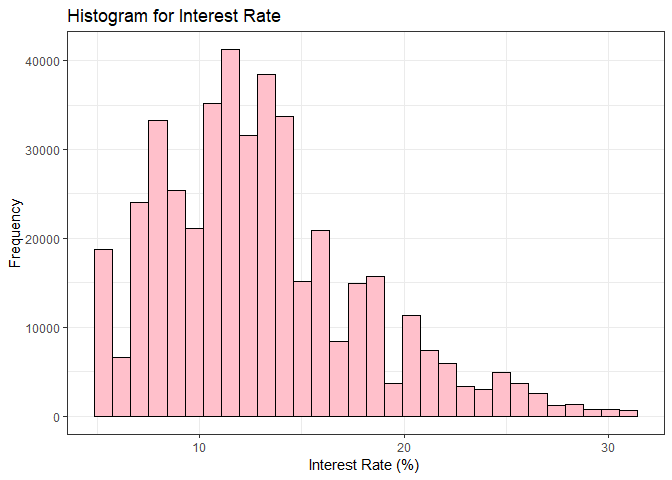<!-- -->

```r
qplot(log(annual_inc), int_rate, data=loanstats, xlab = "log(Annual Income)", ylab = "Interest Rate (%) ", colour = annual_inc )+ theme_bw()
```

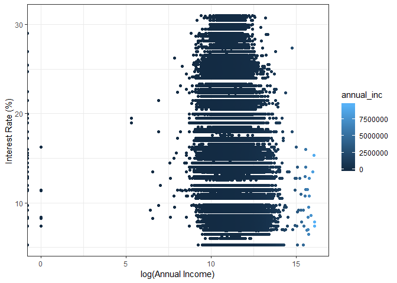<!-- -->

```r
qplot((fico_range_high+fico_range_low)/2, int_rate, data=loanstats, xlab = "Mean FICO Score", ylab = "Interest Rate (%) ", colour = (fico_range_high+fico_range_low)/2 )+ theme_bw()
```

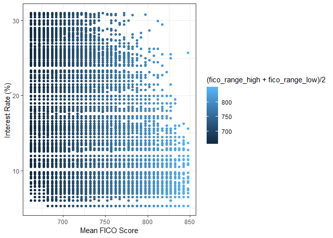<!-- -->

```r
qplot(loan_amnt , loan_status, data=loanstats, xlab = "Loan Ammount", ylab = "Loan Status", colour = loan_amnt)+ theme_bw()
```

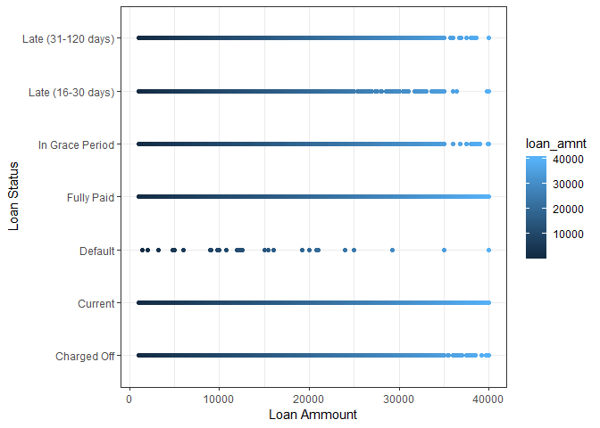<!-- -->
